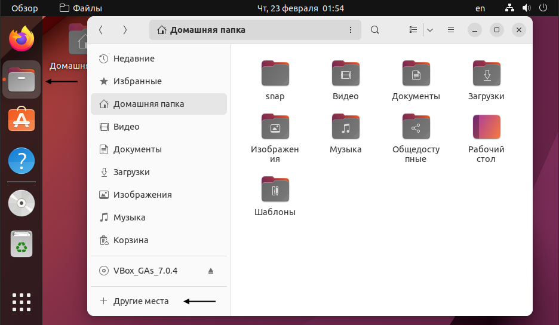
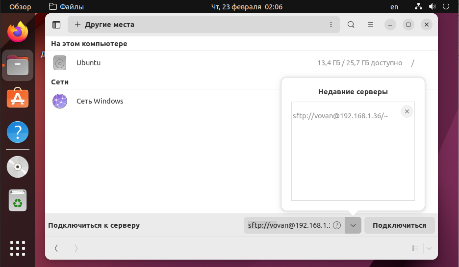
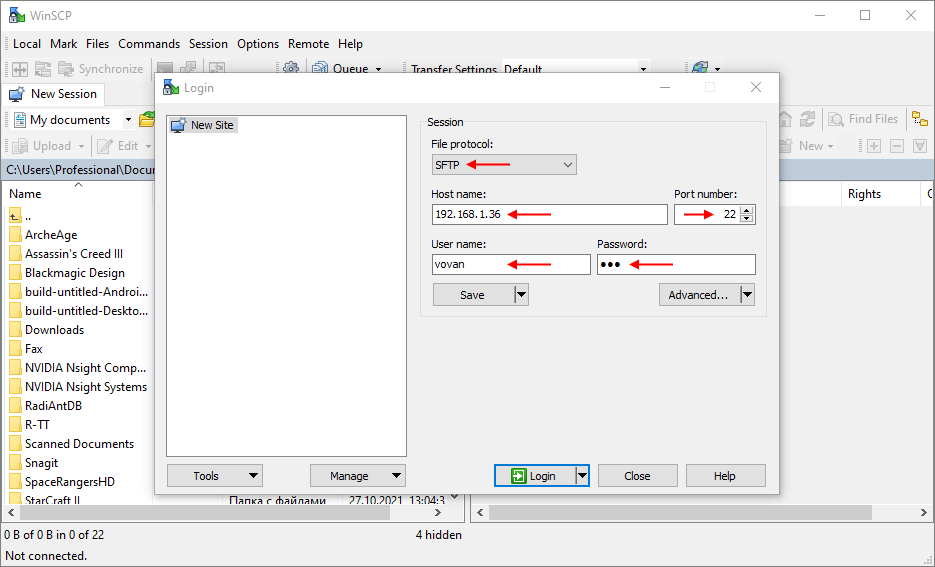
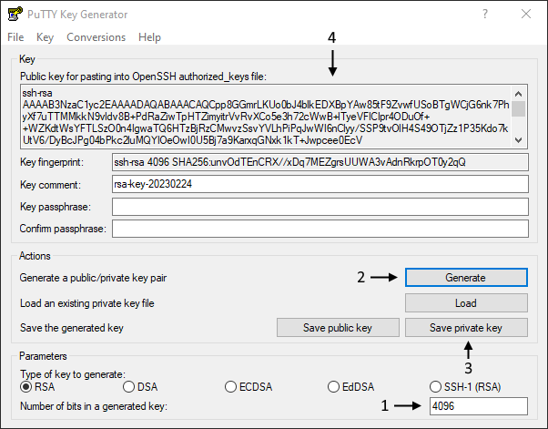
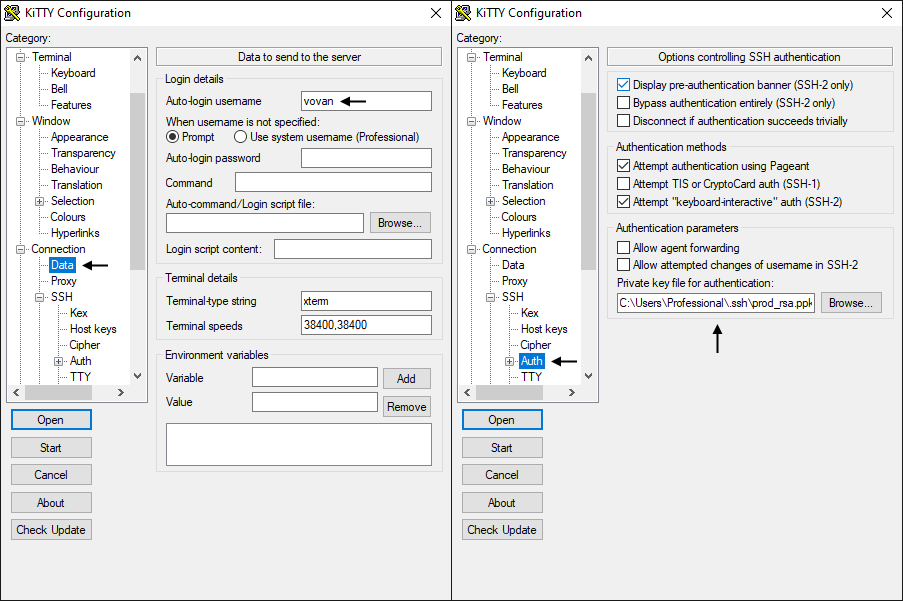
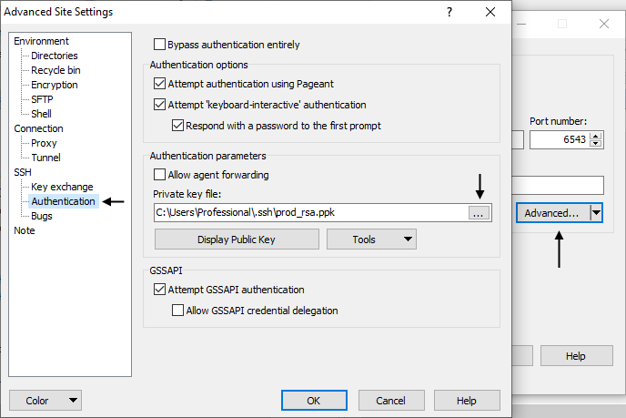

# Практическое задание 1. Организация удалённого доступа в OC Linux.

## Основные теоретические сведения

**Цель:** Ознакомиться на практике со средствами удаленного управления в операционной системе Linux. Приобрести опыт и навыки управления удаленным доступом посредством ssh.

## Теоретическая часть

### Протоколы удаленного доступа: telnet и ssh

Средства для работы с Сетью встроены непосредственно в ядро операционных систем семейства Unix, а все необходимое программное обеспечение для организации сервера входит в состав дистрибутива. UNIX-система работает со всеми сетевыми протоколами (особенно с TCP/IP) лучше, чем любая другая операционная система для платформы Intel. Недаром говорят, что UNIX создан для сети, как птица для полета. Все перечисленные выше качества касаются также и ОС Linux. Существует множество направлений, где используются Linux-серверы: WWW-серверы, FTP-серверы, почтовики, шлюзы. Поэтому удаленное управление Linux-сервером имеет большое значение.

Для удаленного доступа к Linux используются два протокола telnet и SSH. Telnet - протокол линии передачи данных Интернет, который дает возможность компьютеру функционировать как терминал, работающий под управлением удаленного компьютера. Протокол telnet был первоначально разработан для ARPAnet и является важной частью протокола передачи данных TCP/IP.

Имеются три главных проблемы связанные с использованием telnet, делая его плохим выбором для современных систем с точки зрения безопасности: 

- Используемые по умолчанию демоны telnet имеют несколько уязвимостей, обнаруженных за эти годы, и вероятно еще несколько до сих пор существуют.
- Telnet не шифрует никакие данные, которые посылаются через установленную связь (включая пароли), и таким образом становится возможным прослушивание связи и использование пароля позже для злонамеренных целей. 
- Отсутствие системы аутентификации в telnet не дает никакой гарантии, что 
связь, установленная между двумя удаленными хостами не будет прервана в середине.

Нежелательно использование протокола telnet в системах, для которых важна безопасность, таких как общественный Интернет. Сеансы telnet не поддерживают шифрование данных. Это означает это любой, кто имеет доступ к любому маршрутизатору, коммутатору или шлюзу в сети между двумя удаленными компьютерами, соединенными сеансом связи по протоколу telnet, может перехватить проходящие пакеты и легко получить логин и пароль для доступа в систему (или завладеть любой другой информацией, которой обмениваются эти компьютеры) при помощи любой общедоступной утилиты подобно 
tcpdump и Ethereal.

SSH - (Secure Shell) — сетевой протокол, позволяющий производить удалённое управление компьютером и передачу файлов. Похож по функциональности с протоколом telnet , однако использует алгоритмы шифрования передаваемой информации. 

Недостатки telnet привели к очень быстрому отказу от использования этого протокола в пользу более безопасного и функционального протокола SSH. SSH предоставляет все те функциональные возможности, которые представлялись в telnet, с добавлением эффектного кодирования с целью предотвращения перехвата таких данных, как логины и пароли. Введенная в протоколе SSH система аутентификации с использованием публичного ключа гарантирует, что удаленный компьютер действительно является тем, за кого себя выдает. 

Поскольку использование для удаленного управления протокола telnet неправильно с точки зрения безопасности, в лабораторной работе рассмотрим только удаленное управление по SSH.

На данный момент существует две версии протокола SSH:

Описание технологии протокола SSH-1:

Сначала клиент посылает серверу запрос на установление SSH соединения и создание нового сеанса. Соединение будет принято сервером, если он принимает сообщения подобного рода и готов к открытию нового сеанса связи. После этого клиент и сервер обмениваются информацией, какие версии протоколов они поддерживают. Соединение будет продолжено, если будет найдено соответствие между протоколами и получено подтверждение о готовности обеих сторон продолжить соединение по данному протоколу. Сразу после этого сервер посылает клиенту постоянный публичный и временный серверный ключи. Клиент использует эти ключи для зашифровки сессионного ключа. Несмотря на то, что временный ключ посылается прямым текстом, сессионный ключ по-прежнему безопасный. После этого сессионный ключ шифруется временным ключом и публичным ключом сервера и, таким образом, только сервер может его расшифровать. На этом этапе и клиент и сервер обладают сессионным ключом и, следовательно, готовы к безопасному сеансу передачи зашифрованных пакетов.

Аутентификация сервера происходит исходя из его возможности расшифровки сессионного ключа, который зашифрован публичным ключом сервера. Аутентификация клиента может происходить различными способами, в том числе DSA, RSA, OpenPGP или по паролю. Сессия продолжается до тех пор, пока и клиент и сервер способны аутентифицировать друг друга. Установленное соединение по протоколу SSH-1 позволяет защитить передаваемые данные стойким алгоритмом шифрования, проверкой целостности данных и сжатием.

Описание технологии протокола SSH-2:

Оба протокола, по сути, выполняют одни и те же функции, но протокол SSH-2 делает это более элегантно, более безопасно и более гибко. Основное различие между протоколами заключается в том, что протокол SSH-2 разделяет все функции протокола SSH между тремя протоколами, в то время как протокол SSH-1 представляет собой один единый и неделимый протокол. Модуляцией функций протокола SSH в трех протоколах – протоколе транспортного уровня, протоколе аутентификации и протоколе соединения, делает протокол SSH-2 наиболее гибким и мощным механизмом создание безопасных туннелей. Ниже дано краткое описание и назначение каждого из трех протоколов, составляющих протокол SSH-2:

- Протокол транспортного уровня – предоставляет возможность шифрования и сжатия передаваемых данных, а также реализует систему контроля целостностью данных. 
- Протокол соединения – позволяет клиентам устанавливать многопоточное соединение через оригинальный SSH туннель, таким образом, снижая нагрузку, которую создают клиентские процессы.
- Протокол аутентификации – протокол аутентификации отделен от протокола транспортного уровня, т.к. не всегда бывает необходимым использование системы аутентификации. В случае если нужна аутентификация, процесс защищается оригинальным безопасным каналом, установленным через протокол транспортного уровня.

Следует отметить, что протокол SSH не решает всех проблем сетевой безопасности. Он лишь фокусирует свое внимание на обеспечении безопасной работы таких приложений, как эмуляторы терминала. Использование реализаций протокола SSH на серверах и в клиентских приложениях помогает защитить данные лишь в процессе передачи. Протокол SSH ни коим образом не является заменой брандмауэров, систем обнаружения вторжений, сетевых сканеров, систем аутентификации и других инструментов, позволяющих защитить информационные системы и сети от атак.

Сервером SSH служит демон sshd, который запускается на UNIX-машине. 
В качестве SSH-клиента в настоящее время используют OpenSSH, PuTTY, KiTTY, SecureCRT, SFTPPlus, TeraTerm и др. В лабораторном практикуме будут использованы наиболее распространенные OpenSSH – для подключение Linux-клиента и KiTTY – для подключения Windows-клиента.

OpenSSH (Open Secure Shell - открытый безопасный shell) - набор программ, предоставляющих шифрование сеансов связи по компьютерным сетям с использованием протокола SSH. Он был создан под руководством Тео де Раадта как открытая альтернатива коммерческого ПО от SSH Communications Security. 
KiTTY (от TTY — телетайп) - свободно распространяемый клиент для протоколов SSH. Изначально разрабатывался для Windows, однако позднее портирован на Unix.

## Задания к практической работе

Каждую выполненную вам команду и результат её работы поместите в отчёт в виде скриншота.

1. Создайте новую виртуальную машину и установите Ubuntu Server. Образ можно скачать на официальном [сайте](https://ubuntu.com/). В процессе установки можно оставить настройки по умолчанию. Инструкцию с комментариями по каждому шагу можно найти тут: https://losst.pro/ustanovka-ubuntu-server-20-04. На данный момент доступна версия 22.04 LTS, но в процессе установки нет серьёзных отличий от инструкции:

   - В процессе создания виртуальной машины установите галочку "Пропустить автоматическую установку", для того, чтобы иметь возможность выполнить конфигурирование сервера;
   - После шага 6, в указанной выше инструкции, пропущен выбор типа установки **Ubuntu Server** или **Ubuntu Server (minimized)**, второй вариант предусматривает использование в контейнерах и виртуальных машинах, не подразумевающих интерактивный вход и ручное управление. Это значит, что в такой системе отсутствуют утилиты ручного управления и если вы все-таки захотите администрировать ее руками, то вам придется развернуть ее до уровня Ubuntu Server. Поэтому здесь оставляем Ubuntu Server.
   - На шаге 7, настройки сетевого подключения менять не нужно.
   - На шаге 10, можно ничего не менять, а оставить Use an entire disk.

2. После установки, перезагрузите сервер и залогиньтесь используя имя пользователя и пароль указанные в процессе установки.

3. Как обычно, первым делом выполните обновление индекса пакетов и обновите устаревшие: `sudo apt-get update && sudo apt-get upgrade`

4. Затем убедитесь, что ssh-сервер установлен и запущен: `systemctl status ssh`. Вывод должен быть примерно такой:  
   

5. Если ssh-сервер не установлен, то установите его и добавьте в автозагрузку ([подробнее](https://losst.pro/ustanovka-ssh-ubuntu-16-04)):  
   ```bash
   sudo apt install openssh-server
   sudo systemctl enable sshd
   ```

6. Прежде чем заняться настройкой ssh-подключения попробуем подключится к серверу с другой машины. Но прямо сейчас мы не сможем это сделать, т.к. VirtualBox по умолчанию для каждой виртуальной машины создаёт отдельную сеть и сама машина размещается в ней за [NAT](https://youtu.be/L1JtmAiSaFQ). Т.е. машина имеет доступ из сети наружу, а снаружи к машине никто доступ не имеет.

7. Изменим тип сетевого подключения виртуальной машины на **Сетевой мост**. Это приведёт к тому, что виртуальная машина подключится к нашему роутеру как отдельное устройство и в результате хостовая и виртуальная машины будут в одной локальной сети которую создаёт роутер.  
   Чтобы это сделать выключите сервер: `poweroff`, и в окне VutrualBox откройте Настройки виртуальной машины и в разделе "Сеть" выберите [Тип подключения](https://losst.pro/nastrojka-seti-virtualbox) "Сетевой мост":  
   

8. Заново запустите сервер и посмотрите список сетевых интерфейсов: `ip a`. Кроме интерфейса с ip-адресом 127.0.0.1 должен быть второй, соответствующий подключению к роутеру. В моём случае роутер выдал серверу такой ip:  
   

9. Проверьте, что сервер доступен из хостовой ОС при помощи утилиты `ping`:   `ping 192.168.1.36`. Здесь и далее вместо `192.168.1.36` используйте ip адрес **своего** сервера.  
   Вообще говоря можно пропинговать и в обратную сторону, но в случае, если вы работаете на Windows 8 и старше, то настройки по умолчанию запрещают Windows отвечать на ping-запросы. При желании вы может эту блокировку [отключить](https://help.keenetic.com/hc/ru/articles/213966229-Отключение-блокировки-ответа-на-ping-запросы-в-ОС-Windows-8-10).  
   Получить список сетевых интересов и их ip-адреса в Windows можно командой `ipconfig`.

10. Теперь убедимся, что мы можем из хостовой системы подключится к серверу по ssh.  
    Если выработаете на Unix подобной ОС, то воспользуйтесь стандартной утилитой `ssh`: `ssh имя_пользователя@ip_адрес`.  
    Если вы работаете под Windows, то скачайте ssh клиент [KiTTY](https://www.fosshub.com/KiTTY.html) (можно portable, чтобы не устанавливать). Запустите его и укажите ip-адрес сервера. Порт по умолчанию для ssh соединения 22  
    

    Под Windows также можно воспользоваться утилитой ssh при помощи любого эмулятора терминала Linux. Например можно воспользоваться тем, который идёт в комплекте с утилитой git (тот что в контекстном меню назван Git Bash).

11. Если подключение будет установлено успешно, то вы увидите предупреждение, о том, что вы первый раз подключаетесь к указанному хосту и вопрос, действительно ли мы уверены, что это тот самый компьютер, к которому мы хотим подключаться. Ответьте согласием и в дальнейшем это предупреждение не будет выводится, т.к. клиент запомнит указанный хост.  
    Информация о всех известных хостах, на Unix-системах, хранится в рабочем каталоге в файле `.ssh/known_hosts`. Каждый раз, когда мы подключаемся по протоколу ssh к серверу, ssh клиент проверяет совпадает ли публичный ключ, который нам прислал сервер в этот раз, с тем который был прошлый раз и если это не так, то в подключении будет отказано (возможно это злые хацкеры прикидываются вашим сервером).

12. В зависимости от того при помощи какой программы вы подключались у вас запросят имя пользователя и пароль или только пароль. Если всё прошло успешно, вы должны увидеть приветственное сообщение и изменение приглашения к вводу. Теперь все ваши команды будут выполнены на сервере.

13. Завершите сеанс командой `exit`.

14. Довольно часто требуется получить файлы сервера или наоборот отправить файлы на сервер. Чтобы выполнить это безопасным образом через ssh туннель существует [утилита scp](https://losst.pro/kopirovanie-fajlov-scp) (Secure Copy Command).  scp входит в состав стандартных для Unix-систем и не требует дополнительной установки.
    Для Windows, либо используйте эмулятор терминала Linux или скачайте утилиту `pscp` с [сайта PuTTY ](https://www.chiark.greenend.org.uk/~sgtatham/putty/latest.html)и положите её в какую ни будь папку (как вариант C:\ssh). Чтобы запускать pscp просто по имени, можно добавит путь C:\ssh в системную переменную PATH или же запускать так: C:\ssh\pscp.

15. На сервере в домашнем каталоге создайте папку "info".

16. На хостовой машине создайте файл "get_info.py" со следующим содержимым:  
    ```python
    import platform
    print(platform.uname())
    ```

    Я создам его на рабочем столе.

17. Воспользуйтесь утилитой `scp` или `pscp`  (у них одинаковый синтаксис) чтобы скопировать файл "get_info.py" с хостовой машины на сервер в каталог "info".  
    Я воспользуюсь `pscp`, команду буду выполнять в `cmd`, при этом мой текущий каталог - это рабочий стол.  Команда будет выглядеть так:

    ```bash
    C:\ssh\pscp get_info.py vovan@192.168.1.36:/home/vovan/info/
    ```

    В начале указан путь к источнику, а затем путь к приёмнику. Источник у меня локальный файл "get_info.py" на рабочем столе, а приёмник - это каталог "/home/vovan/info/" на удалённой машине с хостом 192.168.1.36. Файл будет создан от имени пользователя "vovan" (этого пользователя я создал во время установки Ubuntu Server).

18. Если соединение установится успешно, вы снова получите уведомление и вопрос про доверие хосту (т.к. это уже другая утилита и у неё свой кэш). Согласитесь, а затем введите пароль.

19. Откройте виртуальную машину с сервером и убедитесь, что файл "get_info.py" находится в каталоге "info" и его содержимое соответствует исходному.

20. Перейдите в каталог "info" и запустите скрипт, при этом результат его работы перенаправьте в файл "log.txt":  
    ```bash
    python3 get_info.py > log.txt
    ```

21. Теперь выполним копирование файлов с сервера на хостовую машину. Для этого снова перейдите в терминал на хостовой машине (у мне это по прежнему `cmd`) и выполните команду:  
    ```bash
    C:\ssh\pscp -r vovan@192.168.1.36:/home/vovan/info .
    ```

    Этой командой мы копируем с удалённой машины 192.168.1.36 от имени пользователя "vovan" каталог "/home/vovan/info" (поэтому нужен ключ `-r`) в текущую папку на хостовой машине ".". В моём случае я по прежнему нахожусь на рабочем столе, поэтому там  и появится каталог "info" со всеми файлами внутри.

22. Не всегда удобно работать с файлами в терминале, и хочется привычный оконный интерфейс. 

23. Рассмотрим вариант решения этой задачи под Linux (например Ubuntu). Встроенный файловый менеджер может без проблем подключится к удалённому серверу и с файлами можно будет работать также, как и со своими собственными:  
      
    Для этого откройте файловый менеджер и щёлкните по пункту "Другие места" (иногда "Подключится к серверу") и укажите куда нужно подключится: `sftp://vovan@192.168.1.36/~`.  
    В данном случае я хочу подключится к серверу 192.168.1.36 под пользователем "vovan" по протоколу "sftp" (можно ssh) по стандартному порту (можно указать другой через двоеточие после хоста) и открыть домашний каталог пользователя (в дальнейшем можно будет переходить в другие).  
      
    После подключения введите пароль.  
    **Внимание:** на забудьте поменять тип сетевого подключения виртуальной машины на **Сетевой мост**.

24. Рассмотрим вариант решения этой задачи под Windows. Проще всего воспользоваться программой WinSCP. Скачайте и установите последнюю версию с [официального сайта ](https://winscp.net/eng/download.php)(или portable версию). Может понадобится VPN.  
    После запуска вам предложат начать новую сессию. Заполните поля и подключитесь к серверу.  
      
    После подключения можно работать с файлами обычным образом. WinSCP поддерживает drag and drop, поэтому копировать файлы можно обычным перетаскивание мышью.  
    Функционал WinSCP довольно широк, тут же можно выполнить команды на удалённом сервере через встроенный терминал, настроить интеграцию с PuTTY и т.д.

25. Теперь рассмотрим следующую ситуацию:

    У нас есть:

    - Свежий удалённый Ubuntu Server с установленным ssh-сервером. Эту роль будет исполнять виртуальная машина которую мы создали в этой работе. Предполагается, что она запущена, но физического доступа к ней у нас нет.
    - Машина с которой мы администрируем сервер. Машина всегда одна и та же и у неё фиксированный ip-адрес. В нашем случае это будет хвостовая машина.
    - Пользователь, которому нужно дать доступ к серверу. Пользователь может работать с разных машин и у него динамический ip. Это будет виртуальная машина, которую вы создавали в предыдущих работах.

    Мы хотим:

    - Настроить сервер так, чтобы доступ к пользователю-админу был только с нашей админской машины;
    - Изменить способ доступа с админской машины на  доступ по ключу, а не по паролю (для безопасности).
    - Дать доступ к серверу обычному пользователю с любой машины по паролю.

26. Запустите виртуальную машину с Ubuntu Server-ом, если она остановлена (логиниться не обязательно).

27. Из хостовой машины подключитесь к серверу по ssh через любой клиент и залогиньтесь.

28. Для начала выполним базовые настройки безопасности ssh-сервера. Для этого отредактируем конфигурационный файл "/etc/ssh/sshd_config" (**не перепутайте с** ssh_config). Откройте его в любой текстовом редакторе (через sudo):

    - Довольно часто боты сканируют 22 порт на наличие ответа от ssh-сервера и пытаются подобрать пароль к нему по базе самых популярных паролей. Изменим порт для ssh на любой свободный, например на 6543. Это не спасёт нас от взлома, если этого сильно захотят, но зато мы не будем тратить ресурсы нашего сервера на установку "мусорных" подключений со случайными ботами.  
      Для этого найдите строку `#Port 22`, уберите символ `#` и укажите выбранный порт.
    - Запретим устанавливать связь по протоколу версии 1.  
      Для этого добавьте: `Protocol 2`.
    - В Ubuntu, по умолчанию, мы не сможем сразу подключится по ssh как пользователь root с использованием пароля (т.к. он не задан), но в других дистрибутивах такая возможность есть. Поэтому, на всякий случай, вообще отключим возможность подключения по ssh для root, хоть по паролю, хоть по чему угодно другому.  
      Для этого найдите:  `#PermitRootLogin prohibit-password` и замените на `PermitRootLogin no`.
    - Иногда пользователям очень удобно создавать пустые пароли, чтобы не запоминать сложные пароли. Такая практика может нанести ущерб безопасности вашего сервера. Следовательно, вам необходимо отклонить все попытки аутентификации с пустыми паролями.  
      Для этого найдите:  `#PermitEmptyPasswords no` и уберите `#`.

    Теперь сохраните файл и выполните команду `sudo sshd –t`. Если вывода не будет, то значит тестовый запуск ssh-сервера прошёл успешно и в конфиге ошибок нет.

29. Перезапустите ssh-сервер, чтобы настройки вступили в силу: `sudo service sshd reload`.  При последующий соединениях нужно будет указывать новый порт.

    - В утилите `ssh` это делается при помощи ключа `-p`: `ssh vovan@192.168.1.36 -p 6543`;
    - В утилите `scp` и `pscp`, также, но большая P `-P`: `scp -P 6543 src vovan@192.168.1.36:dst `;
    - В файловом менеджере Ubuntu, через `:` после хоста: `sftp://vovan@192.168.1.36:6543/~`;
    - В KiTTY и WinSCP есть специальное поле для ввода порта.

30. Теперь настроим доступ для нашей админской машины. Для начала ограничим доступ для админского аккаунта (у меня это "vovan") только своим ip-адресом (у меня это 192.168.1.38). Это можно делать, т.к. по условию у нас фиксированный ip и он внезапно не изменится. Если это произойдёт, мы потеряем удалённый доступ к машине.  
    Для этого снова откройте файл "/etc/ssh/sshd_config" и добавьте строку:  

    ```
    AllowUsers = vovan@192.168.1.38
    ```

    Выполните тестовый запуск sshd чтобы убедится в отсутствии ошибок, а затем перезапустите sshd.

    **Внимание**: 192.168.1.38 - это ip-адрес **не** виртуальной машины с Ubuntu сервером, а ip основной машины, т.е. в моём случае Windows, т.к. с неё я планирую заходить на этот сервер. У самого сервера ip - 192.168.1.36, и если написать `AllowUsers = vovan@192.168.1.36`, то на сервер можно будет зайти **только** с него самого, а нам это не нужно.
    
31. Завершите подключение к серверу, а затем снова попробуйте подключиться к нему по новому порту. Если всё пройдёт успешно, то можно пока не отключаться, чуть позже нам понадобится доступ к серверу.

32. Следующим шагом настроим доступ для админского хоста 192.168.1.38 по ключу, а не по паролю. Эта процедура будет выполнятся в несколько шагов:  

    - Сначала сгенерируем на локальной машине новую пару приватный-публичный ключ. Приватный ключ используется для расшифровки сообщений и должен держатся в секрете. Публичный ключ используется для зашифровки сообщений и не является секретным.  
      Для генерации пар ключей в Linux обычно используется стандартная утилита "ssh-keygen". На Windows, как правило используют "puttygen" (есть графический интерфейс). Они выполняют одинаковую задачу, но генерируют ключи в разных форматах. "puttygen" может преобразовать свои ключи в формат OpenSSH и обратно.  
      Linux утилиты работают с ключами в формате OpenSSH, а  KiTTY и WinSCP в формате puttygen.  
      Стандартные расширения для ssh-keygen: приватный ключ - без расширения, публичный - ".pub". Для puttygen: приватный ключ - ".ppk", публичный - ."pub".  
      В принципе вы можете держать свои ключи где угодно, но обычно они располагаются в рабочем каталоге пользователя в папе ".ssh": на Windows - `C:\Users\USERNAME\.ssh\` (где USERNAME – имя вашего пользователя); на Linux - `~/.ssh/`.  
      Если вы работаете под Linux, то введите в терминале:  

      - ```bash
        ssh-keygen -t rsa -b 4096
        ```

        В результате будут сгенерирован rsa ключи длиной 4096 бит. На все вопросы утилиты можно нажимать Enter тогда будут созданы и сохранены ключи со стандартными именами без парольной фразы (обычно рекомендуют её задавать, но для простоты мы не будем это делать).

      - Если вы работаете под Windows, то воспользуйтесь эмулятором Linux терминала или скачайте [puttygen](https://www.chiark.greenend.org.uk/~sgtatham/putty/latest.html) (например в ту же папку C:\ssh\\) и запустите её. Поменяйте значение 2048 на 4096 и нажмите Generate. Двигайте мышкой, пока зелёная полоса не заполнится. Сохраните приватный ключ в формате ".ppk", но публичный скопируйте в файл из поля сверху (в формате OpenSS).  
        

      Обычно у публичного и приватного ключа указывают одно и тоже имя, но разное расширение, я назову свои "prod_rsa", чтобы была возможность отличить их от других.

    - Теперь когда у нас есть ключи нужно передать серверу **публичный** ключ. В этом случае сервер автоматически переключится на авторизацию по ключу. Т.е. он будет шифровать пакеты этим ключом и только тот, у кого есть приватный ключ сможет их расшифровать.  
      Для этого скопируйте приватный ключ на сервер в каталог `~/.ssh/` любым способом, который мы использовали выше.

    - Наличие публичного ключа в каталоге `~/.ssh/` никак не повлияет на поведение сервера. Содержимое ключа нужно добавить в файл `~/.ssh/authorized_keys` (по умолчанию), только тогда ssh-сервер будет о нём знать. Например выполнив команду в терминале (используйте своё имя файл-ключа):  
      ```bash
      cat ~/.ssh/prod_rsa.pub >> ~/.ssh/authorized_keys
      ```

      Если вы посмотрите содержимое публичного ключа ("prod_rsa.pub") то заметите, что в конце есть поле в формате — user@machine. Оно не имеет никакого отношения к авторизации и служит только для удобства определения где чей ключ. Это поле может быть поменяно (или даже удалено) без нарушения структуры ключа.

    Теперь можно завершить старую ssh-сессию и попробовать подключится заново. 

33. Если вы попробуете подключится таким же образом как и ранее, то заметите, что сервер по прежнему просит у вас пароль. Дело в том, что по умолчанию, если не удаётся подключится по ключу, то сервер переходит на подключение по паролю. Тут может возникнуть вопрос: в чём безопасность доступа по ключу, если доступ по паролю всё равно остаётся?  
    На самом деле такое поведение прописано в настройках ssh-сервера и мы отключим авторизацию по паролю, но только после того, как убедимся, что авторизация по ключу проходит нормально.

34. Чтобы подключится к серверу по ключу нужно указать ssh-клиенту расположение **приватного** ключа:

    - В утилите `ssh` это делается при помощи ключа `-i` путь к ключу (в формате OpenSSH):  
      ```bash
      ssh vovan@192.168.1.36 -p 6543 -i ~/.ssh/prod_rsa
      ```

    - В утилите `scp` и `pscp` аналогично (для scp ключ в формате OpenSSH, для pscp в формате puttygen):  
      ```bash
      scp -P 6543 -i ~/.ssh/prod_rsa src vovan@192.168.1.36:dst
      ```

    - В файловом менеджере Ubuntu нет возможности это сделать непосредственно в окне. Для этого придётся воспользоваться командой `ssh-add путь_к_ключу` утилиты [`ssh-agent`](http://linux.yaroslavl.ru/docs/conf/security/ssh/OpenSSH_2.html). Данная утилита - это менеджер ключей и если добавить туда приватный ключ, то он будет автоматически подставляется при ssh-подключении (в команды ssh и scp тоже);

    - В KiTTY нужно дополнительно указать имя пользователя и путь к ключу в формате puttygen:  
      

    -  В WinSCP нужно заполнить все поля, кроме пароля, затем нажать "Advanced..." и указать путь к приватному ключу в формате puttygen в пункте меню "Authentication":  
      

35. Выполните подключение в серверу через ssh или KiTTY при помощи ключа.  
    **Внимание:** при успешном подключении запроса пароля быть не должно. Если вас просят вести пароль, значит что-то не так. Проверьте правильность команд и ключей.

36. После того, как вы успешно подключились к серверу отключим возможность авторизации по паролю.  
    Для этого откройте файл "/etc/ssh/sshd_config" и замените `PasswordAuthentication yes` на `PasswordAuthentication no`. Сохраните файл и перезапустите службу ssh: `sudo service sshd reload`.  
    Теперь, при попытке зайти по паролю вы получите сообщение, о неподдерживаемом способе входа.

37. Настройки доступа для админа закончены. Теперь нужно выдать доступу обычному пользователю.  
    Для этого создадим нового пользователя, например с именем "proger": `sudo adduser proger`. Установите пользователю пароль, а на все остальные вопросы можете нажимать Enter.  
    В результате будет создан обычный пользователь без особых права. Он сможет работать только в своём домашнем каталоге. Прав на использование sudo у него тоже нет.  
    Если вам захочется позволить этому пользователю исполнять какие ни будь команды или дать ему возможность использовать sudo, нужно будет отредактировать файл [`/etc/sudoers`](https://itnots.ru/linux/sudoers-pravila-vyborochno-razreshit-vypolnenie-komand-polzovatelyam-bez-root), но для нашей задачи достаточно стандартных прав.

38. На данный момент пользователь "proger" не имеет возможности зайти на сервер, т.к.:

    - доступ по паролю отключён и у пользователя в рабочем каталоге в файле authorized_keys (`~/.ssh/authorized_keys`) нет никаких доверенных ключей. Ключ есть только у пользователя "vovan".
    - даже если мы разрешим доступ по паролю в файле настроек shh-сервера "/etc/ssh/sshd_config" присутствует параметр AllowUsers, для которого мы задали значение: vovan@192.168.1.38. Т.е. только этому пользователю и с этого хоста разрешено подключение.

39. Сделаем для пользователя "proger" исключение и разрешим ему доступ по паролю, при этом для всех остальных пользователей (если их создадут и добавляет в список AllowUser) всё равно будет запрашиваться ключ.  
    Для этого откройте файл "/etc/ssh/sshd_config" и добавьте пользователя "proger" в строку AllowUser через пробел:  

    ```bash
    AllowUser = vovan@192.168.1.38 proger
    ```

    Затем пролистайте файл до самого низа и **в конце** добавьте:  
    ```bash
    Match User proger
            PasswordAuthentication yes
    ```

    Match User позволяет переопределять значения параметров для указанных пользователей. Пользователи перечисляются через запятую.

40. Сохраните файл, проверьте наличие ошибок через тестовый запуск `sudo sshd -t` и перезапустите службу, если все хорошо.

41. Выполните подключение в серверу под пользователем "proger" через новый терминал ssh или KiTTY при помощи пароля.

42. Под пользователем "proger" клонируйте в свой домашний каталог репозиторий: https://github.com/VladimirChabanov/google.git. Чтобы запустить скрипт нужно будет установить зависимости через pip, но pip не установлен, а у пользователя "proger" не достаточно прав, чтобы пользоваться утилитой apt.

43. Под админом выполните установку pip и venv.

44. Под пользователем "proger" создайте в клонированном репозитории виртуальное окружение, активируйте его, скачайте зависимости перечисленные в файле "requirements.txt" и запустите скрипт main.py.  
    Чтобы проверить его работоспособность выполните любой запрос.

## Полезные ссылки

1. [Памятка пользователям ssh](https://habr.com/ru/post/122445/) - в статье описаны функций OpenSSH, которые позволяют сильно упростить жизнь системным администраторам и программистам, которые не боятся шелла;
2. [Полное руководство по SSH в Linux и Windows](https://hackware.ru/?p=10059) - очень много информации про SSH. Реально полное руководство;
3. [Установка SSH в Ubuntu](https://losst.pro/ustanovka-ssh-ubuntu-16-04) - установка и первичная настройка OpenSSH сервера;
4. [Алгоритм установления соединения в протоколе SSH](https://habr.com/ru/post/425637/) - пошаговое описание процесса установки ssh-соединения;
5. [SSH — настройка доступа к серверу, команды и подключение без паролей](https://sheensay.ru/ssh) - описаны некоторые основные шаги по настройке OpenSSH сервера;
6. [Разрешить или запретить доступ SSH определенному пользователю или группе в Linux](https://itsecforu.ru/2018/07/09/разрешить-или-запретить-доступ-ssh-опред/) - как следует из названия здесь описано как разрешить или запретить доступ SSH к определенному пользователю или группе в Linux;
7. [KiTTY - ssh / telnet client](https://netdotwork.github.io/kitty-client/) - в статье описаны некоторые полезные возможности KiTTY;
8. [Копирование файлов scp](https://losst.pro/kopirovanie-fajlov-scp) - описаны основные возможности scp;
9. [Sudoers правила. Выборочно разрешить выполнение команд пользователям без root](https://itnots.ru/linux/sudoers-pravila-vyborochno-razreshit-vypolnenie-komand-polzovatelyam-bez-root) - в статье описано как при помощи sudo можно выдать или запретить пользователю разрешение исполнять команды от имени **другого** пользователя введя **свой** пароль.


## Вопросы к практическому заданию

Ответы на следующие вопросы поместите в отчёт:

  1. Что такое SSH и для чего используется?
  2. Где можно поменять значение порта для SSH-сервера и какое там указано значение по умолчанию?
  3. Что нужно сделать, чтобы заблокировать доступ по SSH только одному конкретному пользователю?
  4. Какой ключ (публичный или приватный) нужно отправить на сервер, если мы хотим настроить доступ к этому серверу по ключу?
  5. Как при помощи утилиты scp скопировать содержимое каталога "www" расположенного в текущей папке на удалённый хост "site" в каталог "/var/www/"  от имени пользователя "admin"? При условии, что ssh-порт стандартный, а ключ для авторизации расположен по пути ~/.ssh/id_rsa.

## Отчёт

Оформите отчёт в соответствии с шаблоном и загрузите его в элемент Задание с номером работы в мудле.