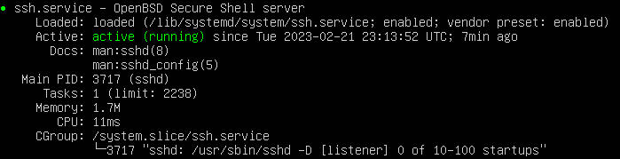
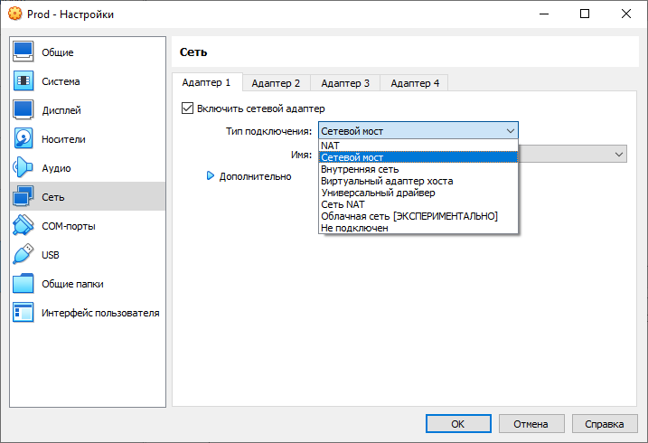
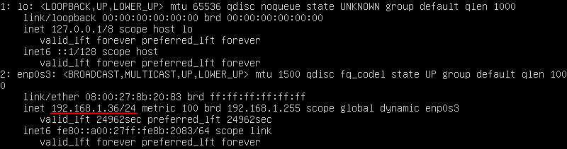
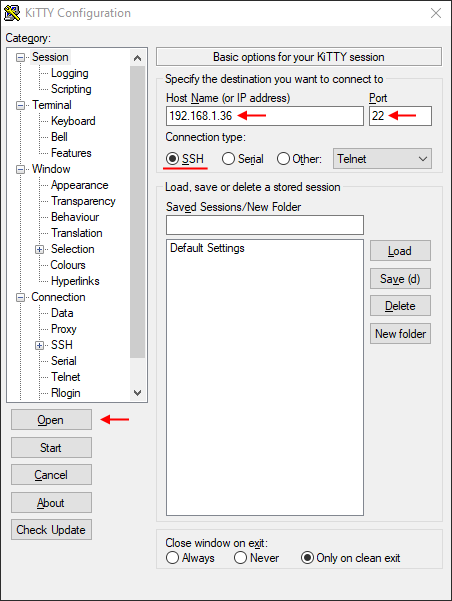

# Практическое задание 1. Организация удалённого доступа в OC Linux.

## Основные теоретические сведения

**Цель:** Ознакомиться на практике со средствами удаленного управления в операционной системе Linux. Приобрести опыт и навыки управления удаленным доступом посредством ssh.

## Теоретическая часть

### Протоколы удаленного доступа: telnet и ssh

Средства для работы с Сетью встроены непосредственно в ядро операционных систем семейства Unix, а все необходимое программное обеспечение для организации сервера входит в состав дистрибутива. UNIX-система работает со всеми сетевыми протоколами (особенно с TCP/IP) лучше, чем любая другая операционная система для платформы Intel. Недаром говорят, что UNIX создан для сети, как птица для полета. Все перечисленные выше качества касаются также и ОС Linux. Существует множество направлений, где используются Linux-серверы: WWW-серверы, FTP-серверы, почтовики, шлюзы. Поэтому удаленное управление Linux-сервером имеет большое значение.

Для удаленного доступа к Linux используются два протокола telnet и SSH. Telnet - протокол линии передачи данных Интернет, который дает возможность компьютеру функционировать как терминал, работающий под управлением удаленного компьютера. Протокол telnet был первоначально разработан для ARPAnet и является важной частью протокола передачи данных TCP/IP.

Имеются три главных проблемы связанные с использованием telnet, делая его плохим выбором для современных систем с точки зрения безопасности: 

- Используемые по умолчанию демоны telnet имеют несколько уязвимостей, обнаруженных за эти годы, и вероятно еще несколько до сих пор существуют.
- Telnet не шифрует никакие данные, которые посылаются через установленную связь (включая пароли), и таким образом становится возможным прослушивание связи и использование пароля позже для злонамеренных целей. 
- Отсутствие системы аутентификации в telnet не дает никакой гарантии, что 
связь, установленная между двумя удаленными хостами не будет прервана в середине.

Нежелательно использование протокола telnet в системах, для которых важна безопасность, таких как общественный Интернет. Сеансы telnet не поддерживают шифрование данных. Это означает это любой, кто имеет доступ к любому маршрутизатору, коммутатору или шлюзу в сети между двумя удаленными компьютерами, соединенными сеансом связи по протоколу telnet, может перехватить проходящие пакеты и легко получить логин и пароль для доступа в систему (или завладеть любой другой информацией, которой обмениваются эти компьютеры) при помощи любой общедоступной утилиты подобно 
tcpdump и Ethereal.

SSH - (Secure Shell) — сетевой протокол, позволяющий производить удалённое управление компьютером и передачу файлов. Похож по функциональности с протоколом telnet , однако использует алгоритмы шифрования передаваемой информации. 

Недостатки telnet привели к очень быстрому отказу от использования этого протокола в пользу более безопасного и функционального протокола SSH. SSH предоставляет все те функциональные возможности, которые представлялись в telnet, с добавлением эффектного кодирования с целью предотвращения перехвата таких данных, как логины и пароли. Введенная в протоколе SSH система аутентификации с использованием публичного ключа гарантирует, что удаленный компьютер действительно является тем, за кого себя выдает. 

Поскольку использование для удаленного управления протокола telnet неправильно с точки зрения безопасности, в лабораторной работе рассмотрим только удаленное управление по SSH.

На данный момент существует две версии протокола SSH:

Описание технологии протокола SSH-1:

Сначала клиент посылает серверу запрос на установление SSH соединения и создание нового сеанса. Соединение будет принято сервером, если он принимает сообщения подобного рода и готов к открытию нового сеанса связи. После этого клиент и сервер обмениваются информацией, какие версии протоколов они поддерживают. Соединение будет продолжено, если будет найдено соответствие между протоколами и получено подтверждение о готовности обеих сторон продолжить соединение по данному протоколу. Сразу после этого сервер посылает клиенту постоянный публичный и временный серверный ключи. Клиент использует эти ключи для зашифровки сессионного ключа. Несмотря на то, что временный ключ посылается прямым текстом, сессионный ключ по-прежнему безопасный. После этого сессионный ключ шифруется временным ключом и публичным ключом сервера и, таким образом, только сервер может его расшифровать. На этом этапе и клиент и сервер обладают сессионным ключом и, следовательно, готовы к безопасному сеансу передачи зашифрованных пакетов.

Аутентификация сервера происходит исходя из его возможности расшифровки сессионного ключа, который зашифрован публичным ключом сервера. Аутентификация клиента может происходить различными способами, в том числе DSA, RSA, OpenPGP или по паролю. Сессия продолжается до тех пор, пока и клиент и сервер способны аутентифицировать друг друга. Установленное соединение по протоколу SSH-1 позволяет защитить передаваемые данные стойким алгоритмом шифрования, проверкой целостности данных и сжатием.

Описание технологии протокола SSH-2:

Оба протокола, по сути, выполняют одни и те же функции, но протокол SSH-2 делает это более элегантно, более безопасно и более гибко. Основное различие между протоколами заключается в том, что протокол SSH-2 разделяет все функции протокола SSH между тремя протоколами, в то время как протокол SSH-1 представляет собой один единый и неделимый протокол. Модуляцией функций протокола SSH в трех протоколах – протоколе транспортного уровня, протоколе аутентификации и протоколе соединения, делает протокол SSH-2 наиболее гибким и мощным механизмом создание безопасных туннелей. Ниже дано краткое описание и назначение каждого из трех протоколов, составляющих протокол SSH-2:

- Протокол транспортного уровня – предоставляет возможность шифрования и сжатия передаваемых данных, а также реализует систему контроля целостностью данных. 
- Протокол соединения – позволяет клиентам устанавливать многопоточное соединение через оригинальный SSH туннель, таким образом, снижая нагрузку, которую создают клиентские процессы.
- Протокол аутентификации – протокол аутентификации отделен от протокола транспортного уровня, т.к. не всегда бывает необходимым использование системы аутентификации. В случае если нужна аутентификация, процесс защищается оригинальным безопасным каналом, установленным через протокол транспортного уровня.

Следует отметить, что протокол SSH не решает всех проблем сетевой безопасности. Он лишь фокусирует свое внимание на обеспечении безопасной работы таких приложений, как эмуляторы терминала. Использование реализаций протокола SSH на серверах и в клиентских приложениях помогает защитить данные лишь в процессе передачи. Протокол SSH ни коим образом не является заменой брандмауэров, систем обнаружения вторжений, сетевых сканеров, систем аутентификации и других инструментов, позволяющих защитить информационные системы и сети от атак.

Сервером SSH служит демон sshd, который запускается на UNIX-машине. 
В качестве SSH-клиента в настоящее время используют OpenSSH, PuTTY, KiTTY, SecureCRT, SFTPPlus, TeraTerm и др. В лабораторном практикуме будут использованы наиболее распространенные OpenSSH – для подключение Linux-клиента и KiTTY – для подключения Windows-клиента.

OpenSSH (Open Secure Shell - открытый безопасный shell) - набор программ, предоставляющих шифрование сеансов связи по компьютерным сетям с использованием протокола SSH. Он был создан под руководством Тео де Раадта как открытая альтернатива коммерческого ПО от SSH Communications Security. 
KiTTY (от TTY — телетайп) - свободно распространяемый клиент для протоколов SSH. Изначально разрабатывался для Windows, однако позднее портирован на Unix.

## Задания к практической работе

Каждую выполненную вам команду и результат её работы поместите в отчёт в виде скриншота.

1. Создайте новую виртуальную машину и установите Ubuntu Server. Образ можно скачать на официальном [сайте](https://ubuntu.com/). В процессе установки можно оставить настройки по умолчанию. Инструкцию с комментариями по каждому шагу можно найти тут: https://losst.pro/ustanovka-ubuntu-server-20-04. На данный момент доступна версия 22.04 LTS, но серьёзных отличий нет:

   - В процессе создания виртуальной машины установите галочку "Пропустить автоматическую установку", для того, чтобы иметь возможность выполнить конфигурирование сервера;
   - После шага 6 в указанной выше инструкции пропущен выбор типа установки **Ubuntu Server** или **Ubuntu Server (minimized)**, второй вариант предусматривает использование в контейнерах и виртуальных машинах, не подразумевающих интерактивный вход и ручное управление. Это значит, что в такой системе отсутствуют утилиты ручного управления и если вы все-таки захотите администрировать ее руками, то вам придется развернуть ее до уровня Ubuntu Server. Поэтому здесь ничего не меняем.
   - На шаге 7 настройки сетевого подключения менять не нужно.
   - На шаге 10 можно ничего не менять, а оставить **Use an entire disk**.

2. После перезагрузки сервера залогиньтесь используя имя пользователя и пароль указанные в процессе установки.

3. Как обычно, первым делом выполните обновление индекса пакетов и обновите устаревшие: `sudo apt-get update && sudo apt-get upgrade`

4. Затем убедитесь, что ssh-сервер установлен и запущен: `systemctl status ssh`. Вывод должен быть примерно такой:  
   

5. Если ssh-сервер не установлен, то установите его и добавьте в автозагрузку ([подробнее](https://losst.pro/ustanovka-ssh-ubuntu-16-04)):  
   ```bash
   sudo apt install openssh-server
   sudo systemctl enable sshd
   ```

6. Прежде чем заняться настройкой ssh-подключения попробуем подключится к серверу с другой машины. Но прямо сейчас мы не сможем это сделать, т.к. VirtualBox по умолчанию для каждой виртуальной машины создаёт отдельную сеть и сама машина размещается в ней за [NAT](https://youtu.be/L1JtmAiSaFQ). Т.е. машина имеет доступ из сети наружу, а снаружи к машине никто доступ не имеет.

7. Изменим тип сетевого подключения виртуальной машины на **Сетевой мост**. Это приведёт к тому, что виртуальная машина подключится к нашему роутеру как отдельное устройство и в результате хостовая и виртуальная машины будут в одной локальной сети которую создаёт роутер.  
   Чтобы это сделать выключите сервер: `poweroff`, в окне VutrualBox откройте Настройки виртуальной машины и в разделе "Сеть" выберите [Тип подключения](https://losst.pro/nastrojka-seti-virtualbox) "Сетевой мост":  
   

8. Заново запустите сервер и посмотрите список сетевых интерфейсов: `ip a`. Кроме интерфейса с ip-адресом 127.0.0.1 должен быть второй, соответствующий подключению к роутеру. В моём случае роутер выдал серверу такой ip:  
   

9. Проверьте, что сервер доступен из хостовой ОС при помощи утилиты `ping` c ip адресом **своего** сервера: `ping 192.168.1.36`. Потерянных пакетов быть не должно.  
   Вообще говоря можно пропинговать и в обратную сторону, но в случае, если вы работаете на Windows 8 и старше, то настройки по умолчанию запрещают Windows отвечать на ping-запросы. При желании вы может эту блокировку [отключить](https://help.keenetic.com/hc/ru/articles/213966229-Отключение-блокировки-ответа-на-ping-запросы-в-ОС-Windows-8-10).  
   Получить список сетевых интересов в Windows можно командой `ipconfig`.

10. Теперь убедимся, что мы можем из хостовой системы подключится к серверу по ssh.  
    Если выработаете на Unix подобной ОС, то воспользуйтесь стандартной утилитой `ssh`: `ssh имя_пользователя@ip_адрес`.  
    Если вы работаете под Windows, то скачайте telnet и ssh клиент [KiTTY](https://www.fosshub.com/KiTTY.html) (можно portable, чтобы не устанавливать). Запустите её и укажите ip-адрес сервера. Порт по умолчанию для ssh соединения 22  
    

11. Если подключение будет установлено успешно, то вы увидите предупреждение, о том, что вы первый раз подключаетесь к указанному хосту и вопрос, действительно ли мы уверены, что это тот самый компьютер, к которому мы хотим подключаться. Ответьте согласием и в дальнейшем это предупреждение не будет выводится, т.к. клиент запомнит указанный хост.  
    Информация о всех известных хостах хранится в рабочем каталоге в файле `.ssh/known_hosts`. Каждый раз, когда мы подключаемся по протоколу ssh к серверу, ssh клиент проверяет совпадает ли публичный ключ для этого сервера с тем, который был прошлый раз и если это не так, то в подключении будет отказано (возможно это злые хацкеры прикидываются вашим сервером).

12. В зависимости от того при помощи какой программы вы подключались у вас запросят имя пользователя и пароль или только пароль. Если всё прошло успешно, вы должны увидеть приветственное сообщение и изменение приглашения к вводу. Теперь все ваши команды будут выполнены на сервере.

13. Завершите сеанс командой `exit`.

14. **Продолжение будет добавлено сегодня**.

## Вопросы к практическому заданию

Ответы на следующие вопросы поместите в отчёт:

  1. **Вопросы будут добавлены сегодня**.

## Отчёт

Оформите отчёт в соответствии с шаблоном и загрузите его в элемент Задание с номером работы в мудле.