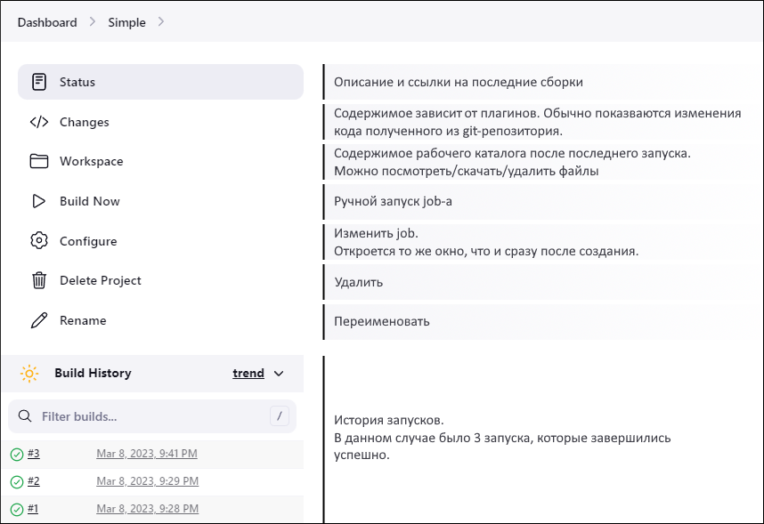
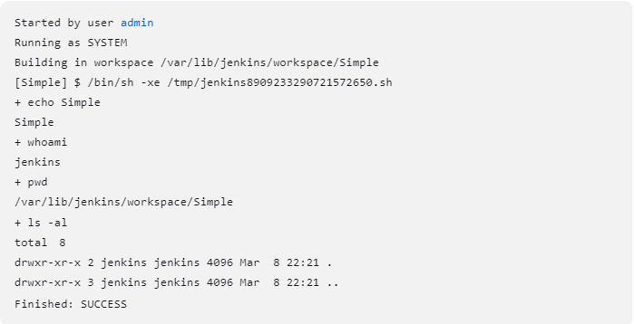
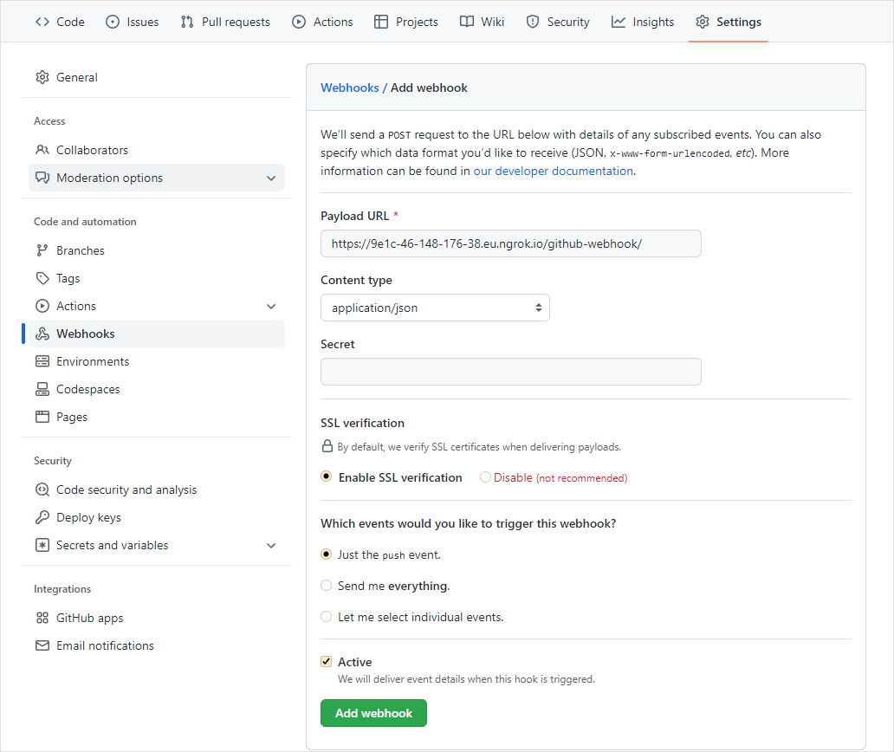

# Практическое задание 2. Знакомство с Jenkins.

**Цель:** Ознакомиться на практике со средствами CI/CD доступными в Jenkins.

## Теоретическая часть

Рекомендуется ознакомится с материалами из раздела "Полезные ссылки".

## Задания к практической работе

Каждую выполненную вам команду и результат её работы поместите в отчёт в виде скриншота.

### Установка

1. Скачать Jenkins можно с [официального сайта](https://www.jenkins.io/download/). Здесь доступно множество вариантов, под разные ОС, в том числе и Jenkins запакованный в Docker-контейнер. В этой работе мы будем устанавливать Jenkins с нуля на Ubuntu.
2. Создайте новую виртуальную машину с Ubuntu Server-ом в качестве имени пользователя выберите любое кроме `jenkins`. В процессе установки можете выбрать автоматическую установку ssh-сервера и docker.  
   На этом сервере будет выполняться сборка и тестирование приложения.
3. В настройках VirutalBox переключите Сеть виртуальной машины в режим "Сетевой мост", затем залогиньтесь и определите ip-адрес машины (в моем случае это: 192.168.1.40). С хостовой машины установите соединение с сервером по ssh с помощью любого, удобного для вас, ssh-клиента.  
   Таким образом будет удобнее выполнять последующие шаги, т.к. можно будет просто копипастить команды.
4. Перейдите на оф. сайт Jenkins в [раздел установки](https://www.jenkins.io/doc/book/installing/linux/#debianubuntu) и установите на сервер сначала Java, а затем и сам Jenkins. Просто последовательно копируйте и запускайте команды указанные в инструкции. Если строка заканчивается на символ `\`, то такие строки нужно копировать по одной, т.к. после `\` ожидается нажатие Enter.

   - Для Jenkins можно выбрать один из вариантов: "Long Term Support release" или "Weekly release". Для этой работы разницы нет, но в "Long Term Support release" обычно меньше багов, т.к. релиз не самый последний и баги уже могли успеть исправить;
   - Инструкция по установке Java расположена под инструкцией по установке Jenkins.
5. Теперь нужно выполнить начальную конфигурацию Jenkins через web-интерфейс.  
   Т.к. машина с сервером на котором установлен Jenkins находится в одной сети с нашей хвостовой машиной, мы можем получить доступ к Jenkins через браузер на хвостовой машине, просто указав в адресной строке браузера ip-адрес сервера и порт 8080 (стандартный порт для Jenkins). В моем случае это: 192.168.1.40:8080.
6. Сначала Jenkins попросит доказать, что вы действительно владелец сервера, для этого нужно скопировать в поле ввода в браузере содержимое файла `/var/lib/jenkins/secrets/initialAdminPassword` расположенного на сервере. Его можно открыть любым текстовым редактором (через `sudo`).
7. Теперь Jebkins предложит выбрать список плагинов для установки. Все плагины можно будет легко установить/удалить в любое время, поэтому выберите любую из кнопок:

   - Install suggested plugins - автоматически установит набор популярных плагинов;
   - Select plugins to install - перед установкой позволит выбрать что устанавливать.
8. Создайте пользователя для управления Jenkins. По умолчанию у него будут права администратора. Эти логин и пароль нужно будет вводить при входе в web-интерфейс Jenkins.
9. По умолчанию Jankins определяет язык интерфейса по настройкам браузера, поэтому вместо английского вы можете увидеть русский текст. Иногда удобнее использовать английский интерфейс (проще гуглить). Если хотите можете оставить русский, но чтобы получить возможность переключить интерфейс на английский язык нужно установить плагин:
   - Выберите в меню справа пункт "Настроить Jenkins" ("Manage Jenkins"), а затем "Управление плагинами" ("Manage Plugins");
   - После этого меню справа переключится в режим управления плагинами. Выберите пункт "Доступные плагины" ("Available plugins") и в строку поиска вбейте "Locale plugin";
   - Поставьте галочку рядом с "Locale plugin" и нажмите кнопку "Download now and install after restart". Плагин проверит зависимости и через некоторое время начнёт установку.
   - В самом низу поставьте галочку "Перезапустить Jenkins по окончанию установки и отсутствии активных задач". Вкладка может не обновится автоматически, поэтому обновите её вручную через некоторое время.
   - Выберите в меню справа пункт "Настроить Jenkins" ("Manage Jenkins"), а затем "Конфигурация системы" ("Configure System");
   - Пролистайте вниз до раздела "Locale". В нем будет поле под названием "Язык по умолчанию" ("Default Language"). Введите "en" или "ENGLISH";
   - В этом же разделе поставьте галочку "Игнорировать настройки браузера и принудительно использовать этот язык для всех пользователей" ("Ignore browser preference and force this language to all users");
   - После того, как вы нажмёте кнопку "Применить" настройки вступят в силу.

### Простой job

Сейчас мы создадим самый просто job с настройками по умолчанию. Job будет состоять только из одного шага в результате которого на сервере будут запущены несколько обычных shell-команд.

1. Чтобы создать новое задание (job) для Jenkins:

   - в меню справа нажмите  кнопку "New Item";
   - введите имя job-a;
   - из списка возможных вариантов выберите первый "Freestyle project" и нажмите кнопку OK.

2. Пролистайте страницу до раздела "Build Steps" и нажмите кнопку "Add build step" в выпадающем списке выберите "Execute shell". В зависимости от установленных плагинов в этом списке могут быть доступны дополнительные варианты позволяющие выполнять некоторые шаги проще.

3. В появившемся поле ввода наберите:  
   ```bash
   echo $JOB_NAME
   whoami
   pwd
   ls -al
   ```

   В первой строке, мы используем переменную окружения, которую устанавливает Jenkins. В данном случае в переменной `JOB_NAME` хранится имя которое мы дали job-у при создании. В этих переменных хранится много полезной информации, поэтому изучите их (ссылка на список доступна в этом же разделе).  
   Остальные три строки, это обычные shell-команды, которые покажут пользователя от чьего имени выполняется данный скрипт, текущий каталог и его содержимое.

4. После того, как вы нажмёте кнопку "Save" job будет сохранён и вас перекинет в меню управления текущим job-ом.  
   

5. Запустите job при помощи кнопки "Build Now".  
   Через несколько секунд вы увидите, что в разделе "Build History" появится первый/новый пункт.

6. Щёлкнув по этому пункту вы попадёте раздел управления результатами сборки. Здесь нас интересует пункт меню "Console Output". Изучите свой вывод.  
   

   Как видно, название job-a у меня "Simple"; скрипт выполнялся от имени пользователя "jenkins"; текущим каталогом был "/var/lib/jenkins/workspace/Simple" и в данный момент он пустой и принадлежит пользователю "jenkins".

7. Если вы перейдёте в раздел "Dashboard" (корень сайта), то обнаружите свой job и здесь.

### Сборка проекта с GitHub

Здесь мы создадим job который получит файлы проекта с GitHub, установит зависимости и запустит проект.

#### Подготовка репозитория

1. Создайте новый каталог на машине, на которой у вас есть утилита git.

2. Создайте три файла со следующим содержимым:

   - ReadMe.md  
     ```markdown
     # Pure python QR Code generator
     ```

   - main.py  
     ```python
     import qrcode
     img = qrcode.make('Some data here')
     img.save("some_file.png")
     ```

   - requirements.txt  
     ```
     qrcode[pil]
     ```

3. Инициируйте в этой папке локальный репозиторий и закоммитьте содержимое.

4. Создайте на github.com репозиторий и синхронизируйте его с локальным. В моём случае это [qr_code_generator](https://github.com/VladimirChabanov/qr_code_generator/tree/efd97701189b9db6eb0a1c601119129058a5c567).

#### Создаём и настраиваем job

1. Создайте новый job типа "Freestyle project".

2. Т.к. у нас уже установлен [Git plugin](https://plugins.jenkins.io/git), то в настройках job-a у нас будет раздел "Source Code Management". В этом разделе нужно установить переключатель на Git (по умолчанию None).

3. В развернувшемся подразделе найдите поле "Repository URL" и вставьте ссылку на созданный ранее GitHub-репозиторий. Ссылку можно получить щёлкнув по зелёной кнопке "Code" на странице репозитория. Пока нам достаточно https ссылки (чтобы не тратить время на настройку ssh).

4. Чуть ниже в поле "Branch Specifier" написано `*/master`. Эту ветку Jenkins попробует получить из  репозитория. Но в нашем репо такой ветки нет. На стадии синхронизации с GitHub мы переименовали её в "main" (командой `git branch -M main`).  
   Замените `*/master` на `*/main`.

5. Перейдите в раздел "Build Steps" и создайте step типа "Execute shell" содержащий команду: `ls -al`.

6. Сохраните и запустите job.

7. После выполнения job-а, посмотрите консольный вывод. Вы должны увидеть, что в текущем рабочем каталоге присутствуют все файлы из репозитория.

8. Вернитесь на страницу управления job-ом и нажмите кнопку "Configure", чтобы изменить job.

9. В разделе "Build Steps" замените `ls -al` на:  
   ```bash
   #!/bin/bash
   python3 -m venv venv
   source venv/bin/activate
   pip install -r requirements.txt
   python main.py
   ```

10. Сохраните и запустите job.

11. Этот запуск должен завершится неудачно. Если вы изучите консольный вывод, то обнаружите, что причина в отсутствии `venv`.  
    Все команды, которые выполняет Jenkins запускаются на той машине, на которой он установлен, т.е. на нашем Ubuntu Server-е. Следовательно, прежде, чем что-то запускать, нужно позаботиться, чтобы оно было установлено.

12. На сервере (через ssh или напрямую) установите `venv` и `pip`.

13. Вернитесь обратно в Jenkins и запустите job повторно.  
    Теперь всё должно выполнится успешно, а в рабочем каталоге должен появится файл "some_file.png". Убедитесь в этом при помощи пункта "Workspace" со страницы управления job-ом.

### Автоматизация сборки проекта с GitHub

Здесь мы настроим процесс автоматического запуска job-а при обнаружении изменений в GitHub-репозитории.

#### Запуск по таймеру

1. Создайте новый job типа "Freestyle project".

2. В разделе "Source Code Management" укажите те же настройки, что и ранее.

3. В разделе "Build Triggers" перечислены источники событий, которые могут инициировать запуск job-a. Поставьте галочку напротив триггера "Poll SCM". Этот триггер будет опрашивать GitHub в соответствии с заданной периодичностью и в случае обнаружения изменений будет запускаться job.

4. В развернувшемся подразделе "Schedule" нужно указать периодичность опроса репозитория в формате cron. Для этого можно воспользоваться подсказкой или онлайн генераторами. Введите в это поле строку: `H/2 * * * *`.  
   Здесь мы просим автоматически проверять репозиторий каждую чётную минуту.

5. Перейдите в раздел "Build Steps" и создайте step типа "Execute shell" содержащий:  
   ```bash
   #!/bin/bash
   python3 -m venv venv
   source venv/bin/activate
   pip install -r requirements.txt
   python main.py
   ```

6. Сохраните job, но НЕ запускайте его вручную. Подождите до ближайшей чётной минуты и job должен будет запуститься автоматически. Затем подождите ещё 3-5 минут. Т.к. репозиторий не изменялся, то и новых запусков в истории появляться не должно.

7. Теперь, в локальном репозитории, QR код генератора измените содержимое файла "main.py" на следующее:  
   ```python
   import qrcode
   img = qrcode.make('Other data here')
   img.save("other_file.png")
   ```

8. Закоммитьте и отправьте изменения на GitHub.

9. Подождите ближайшей чётной минуты и вы должны увидеть, что запустился новый процесс сборки, а в рабочем каталоге появился файл "other_file.png".

10. Минус данного метода в том, что мы вынуждены постоянно выполнять проверку репозитория, при этом нагружая свой сервер и сервера GitHub. Поэтому, чтобы не напрягать GitHub своими запросами зайдите в "Configure" и выключите job. Переключатель вверху страницы переведите из положения "Enabled" в "Disabled".

#### Запуск по событию

1. Создайте новый job типа "Freestyle project".

2. В самом верху можно поставить галочку "GitHub project" и указать URL GitHub репозитория (тоже, что и ранее, но без .git в конце). Этот пункт не обязательный, он приведёт к тому, что в некоторых местах появится ссылка позволяющая перейти на GitHub и больше ничего.

3. В разделе "Source Code Management" укажите те же настройки, что и ранее.

4. В разделе "Build Triggers" поставьте галочку напротив триггера "GitHub hook trigger for GITScm polling". Этот триггер будет запускать job, только в том случае, если GitHub сообщит Jenkins-у о наступлении интересующего нас события (нас будет интересовать `push`).  
   Т.е. не мы дёргаем GitHub, а GitHub уведомляет нас.

5. Перейдите в раздел "Build Steps" и создайте step типа "Execute shell" содержащий:  

   ```bash
   #!/bin/bash
   python3 -m venv venv
   source venv/bin/activate
   pip install -r requirements.txt
   python main.py
   ```

6. Сохраните job, но НЕ запускайте его вручную.

7. На данном этапе Jenkins ждёт уведомлений от GitHub, но GitHub об этом не подозревает. Т.е. теперь мы должны настроить GitHub таким образом, чтобы он отправлял сообщения нашему Jenkins-у.

8. Чтобы GitHub знал кого ему нужно уведомлять о событиях, ему нужно предоставить Webhook (т.е. ссылку), но с этим есть определённая проблема (если у вас не белый IP). Виртуальная машина находится за NAT, и следовательно, снаружи к ней доступа нет.  
   Чтобы решить эту проблему воспользуемся ngrok:

   - Откройте раздел Download на [оф. сайте](https://ngrok.com/download);
   - Скопируйте команду из "Install ngrok via Apt", чтобы установить ngrok через `apt`;
   - Вставьте и выполните её в терминале (через ssh или напрямую);
   - Чтобы ngrok работал понадобится токен, который можно получить в [личном кабинете](https://dashboard.ngrok.com/get-started/your-authtoken) после регистрации. Там же будет команда которую нужно выполнить, чтобы привязать ngrok к аккаунту. Что-то вроде: `ngrok config add-authtoken ваш_токен`.  
     Копируйте её и запускайте в терминале.
   - Запустите ngrok командой: `ngrok --log=stdout http 8080 > ngrok.log &`.  
     Здесь мы просим ngrok, чтобы он пробрасывал http запросы на порт 8080 (это порт Jenkins-а), при этом весь вывод ngrok-а мы перенаправляем в файл ngrok.log (название может быть любым), при этом сам ngrok запускается в фоновом режиме (символ `&` в конце), чтобы он не блокировал терминал.
   - В результате будет сгенерирована ссылка которая будет выполнять роль web-хука для GitHub. Т.к. весь вывод ngrok перенаправляет в файл "ngrok.log", то и нужным нам адрес находится там же.
     Выполните: ` cat ngrok.log | grep url=`. В выводе будет требуемая ссылка.
   - Скопируйте её и вставите в адресную строку браузера. Если в результате откроется Jenkins значит ссылка работает.

9. Перейдите на GitHub в репозиторий с проектом QR код генератора. Перейдите в раздел "Settings" и в левом меню выберите пункт "Webhooks", а затем нажмите кнопку "Add webhook".

10. В поле "Payload URL" вставьте ссылку полученную от ngrok к которой добавьте `/github-webhook/`. В списке "Content type" выберите "application/json". В разделе "Which events would you like to trigger this webhook?" можно выбрать разные события, которые будут приводить к отправке сообщения по webhook-у, но нас интересует только `push`, поэтому оставляем дефолтное значение "Just the push event".  
    

11. Теперь, в локальном репозитории, QR код генератора измените содержимое файла "main.py" на следующее:  

    ```python
    import qrcode
    img = qrcode.make('GitHub Webhook')
    img.save("gitHub_webhook.png")
    ```

12. Закоммитьте и отправьте изменения на GitHub.

13. Откройте Jenkins и теперь вы должны увидеть, что сборка была выполнена.

14. Минус данного метода в том, что мы зависим от ngrok и в случае перезапуска сервера или самого ngrok-a, будет сгенерирована новая ссылка, а значит придётся вносить изменения и на GitHub. Но если у вашего сервера есть белый IP, то данный метод очень хороший.

### Автоматизация отправки на DockerHub

[Будет сегодня]

### Автоматизация деплоя

[Будет сегодня]

## Полезные ссылки

1. [Курс Основы Jenkins на Русском для Девопс Инженеров](https://youtube.com/playlist?list=PLg5SS_4L6LYvQbMrSuOjTL1HOiDhUE_5a) - набор видео-роликов демонстрирующих основные операции по работе с Jenkins.

## Вопросы к практическому заданию

1. Какой стандартный порт который прослушивает Jenkins?;
2. Из какой переменной окружения можно узнать путь к рабочему каталогу данного job-a?
3. Какой триггер нужно использовать, чтобы настроить запуск job-a по понедельникам в 3 часа ночи?
4. Каким образом из Jenkins можно удалить установленный плагин?
5. Где в Jenkins лучше хранить секреты: пароли/токены/ключи с точки зрения безопасности?

## Отчёт

Оформите отчёт в соответствии с шаблоном и загрузите его в элемент Задание с номером работы в мудле.

