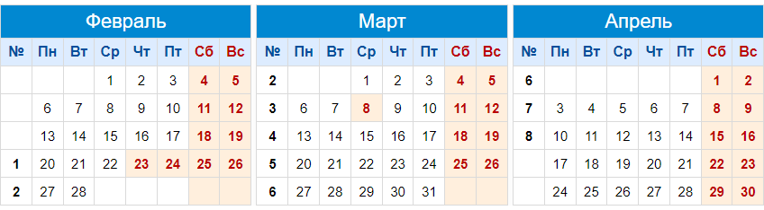

# Курсовая работа

### Календарный план

#### до 5 марта: 

1. Зарегистрировать состав команды заполнив [форму](https://docs.google.com/forms/d/e/1FAIpQLSdmX9COIHlotZL0Qkps1YCZYAW9BBpoWkXiOG4P4lFeTsBORg/viewform?usp=sf_link). Форму заполняет лидер команды;

#### до 16 марта: 

2. Определится с темой и согласовать её с куратором курсовой работы. Кто куратор команды можно посмотреть [тут](https://moodle.cfuv.ru/mod/url/view.php?id=593749);
3. Составить и согласовать с куратором Техническое задание на разработку программного продукта (ТЗ). Шаблон ТЗ можно посмотреть [тут](./files/Техническое_задание.docx);
4. Составить и предоставить куратору Предварительный плана и распределение по задачам. В качестве ориентира используйте [Шаблон плана](https://docs.google.com/spreadsheets/d/1slxdFeByLSl6v5HhrKJC5jbeAAKMXtaROaWq9cxvZxw/edit?usp=sharing). Можно использовать другое оформление, структуру и инструмент ведения плана, главное, чтобы в нём была указана вся требуемая информация;
   - каждая задача назначается только одному участнику;
   - видео про стори поинты: [общая информация](https://youtu.be/IcyX43CAdiI), [пример](https://youtu.be/LlLK03gpiOg) (начиная с 12й минуты по 21ю);
   - в последующих отчётах диаграмму Ганта и распределение стори поинтов можно будет изменять. Старайтесь оценить задачи адекватно, но не бойтесь накосячить.

#### до 19 марта, 26 марта, 2 апреля, 9 апреля:

5. Лидеры формируют и предоставляют куратору Еженедельный отчёт о выполнении курсовой работы. Отчёт является модификацией Предварительного плана. Форма документа такая же.

#### на последней неделе, до даты защиты:

6. Сформировать и оформить пояснительную записку в соответствии с требованиями к [оформлению ВКР ФТИ](./files/Oformlenie-VKR-FTI-2019.pdf). Пояснительная записка должна быть предоставлена на проверку куратору до защиты. Шаблон пояснительной записки:
   - [Шаблон пояснительной записки Чабанов](./files/Шаблон_пояснительной_записки_2021_Чабанов.docx);
   - [Шаблон пояснительной записки Потапова](./files/Шаблон_пояснительной_записки_2021_Потапова.docx);
6. Записать Видео с демонстрацией работы проекта. Видео должно быть предоставлена на проверку куратору до защиты;
7. Подготовить Презентацию и доклад для выступления на защите. Презентация в формате pdf должна быть предоставлена куратору до защиты.

### Примеры проектов

### Чек-лист

Каждый член команды загружает в Moodle полный комплект документов:

- [ ] Техническое задание;
- [ ] Предварительный план и распределение по задачам;
- [ ] Еженедельные отчёты от Лидера команды - 4шт;
- [ ] Пояснительная записка;
- [ ] Видео с демонстрацией работы проекта;
- [ ] Презентация;
